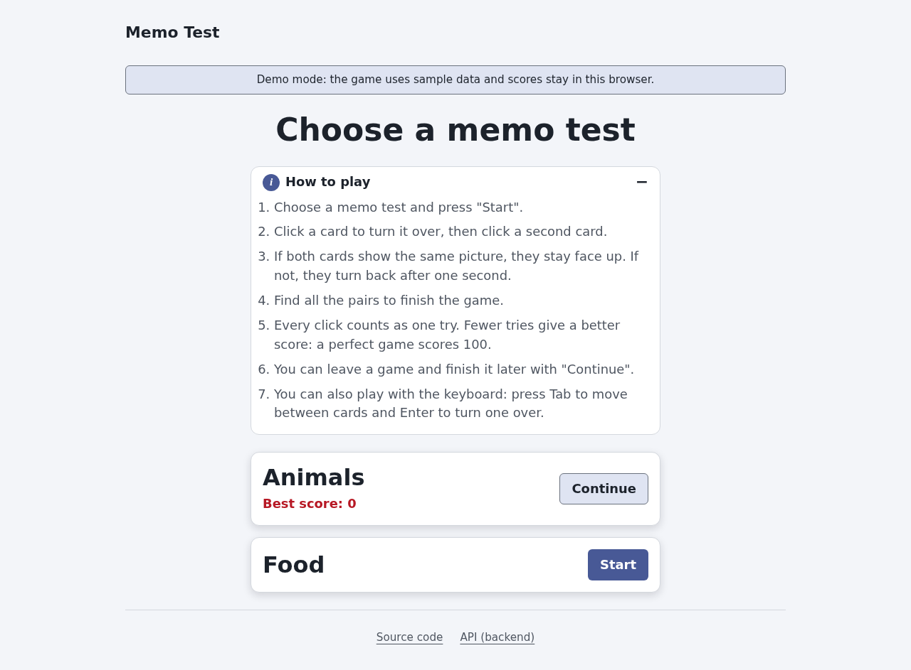
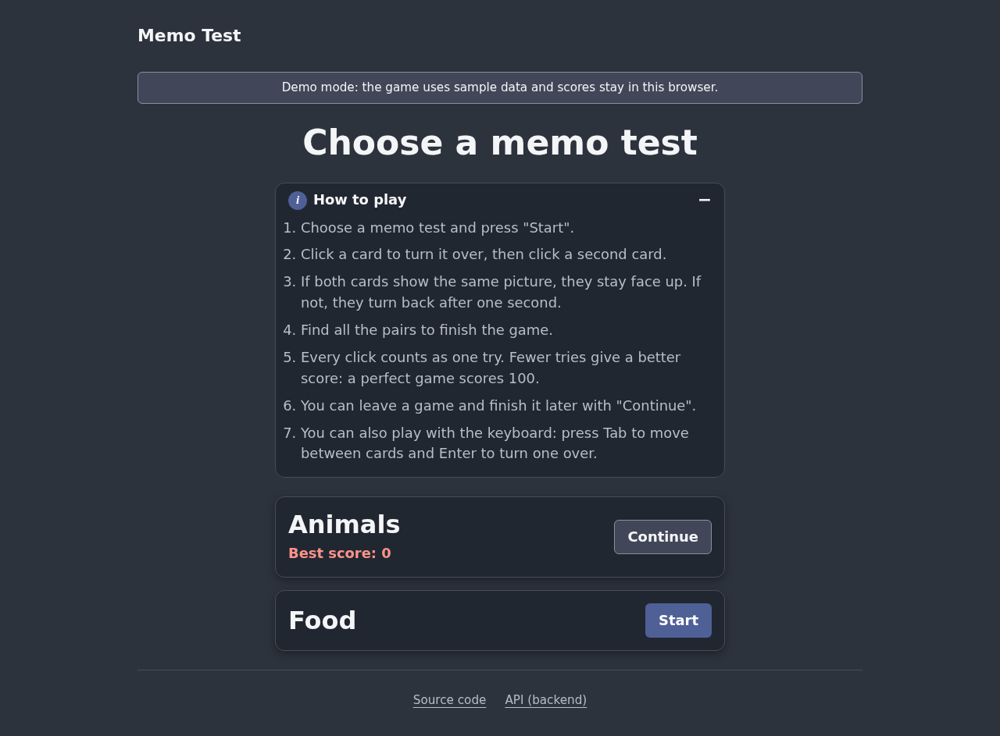
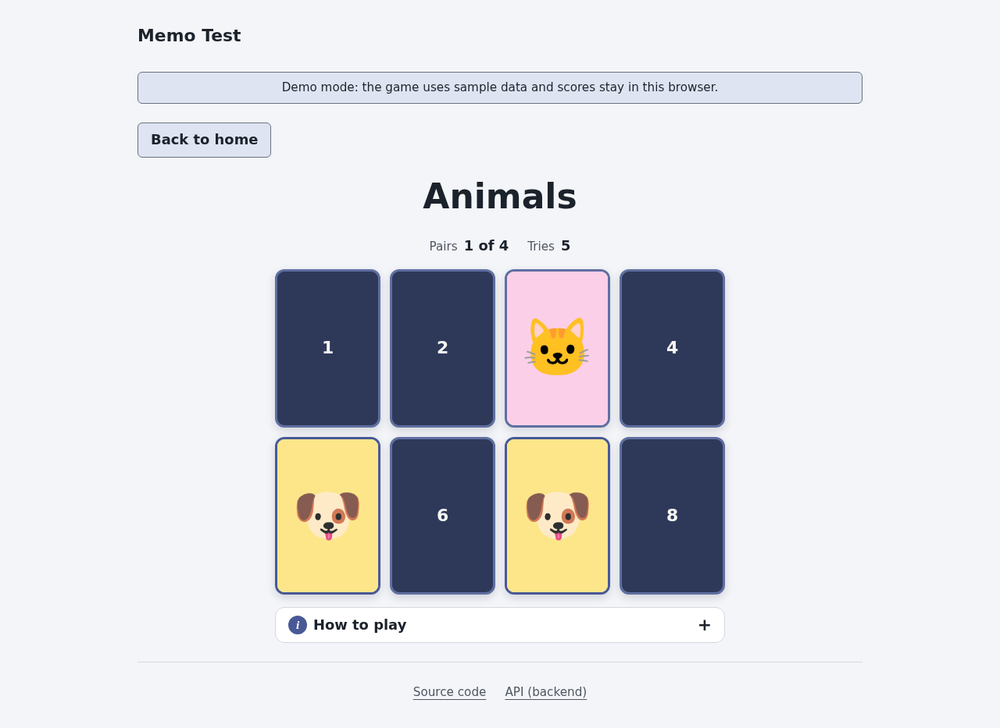
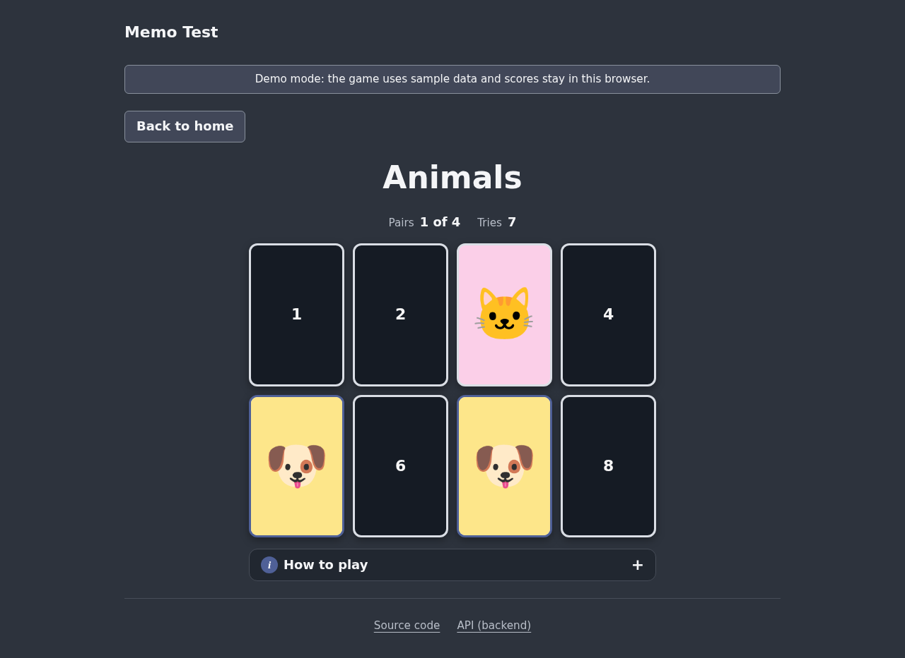
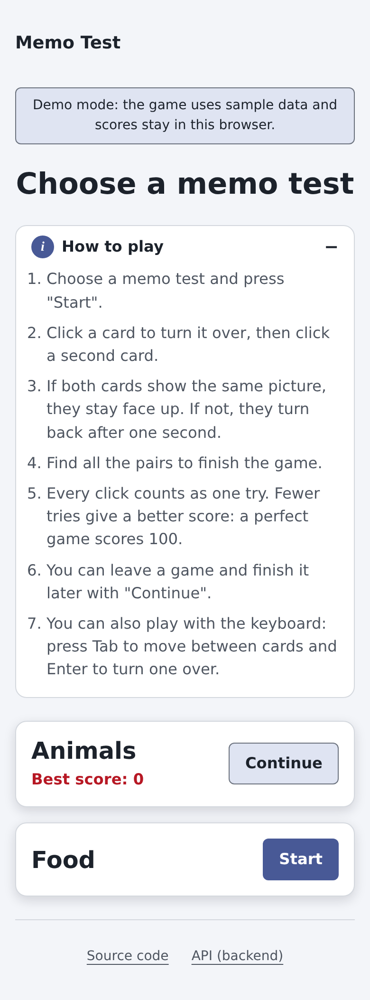
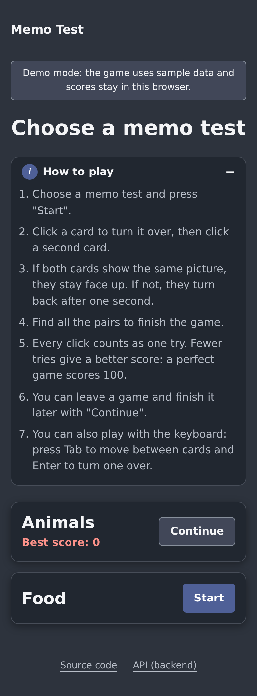
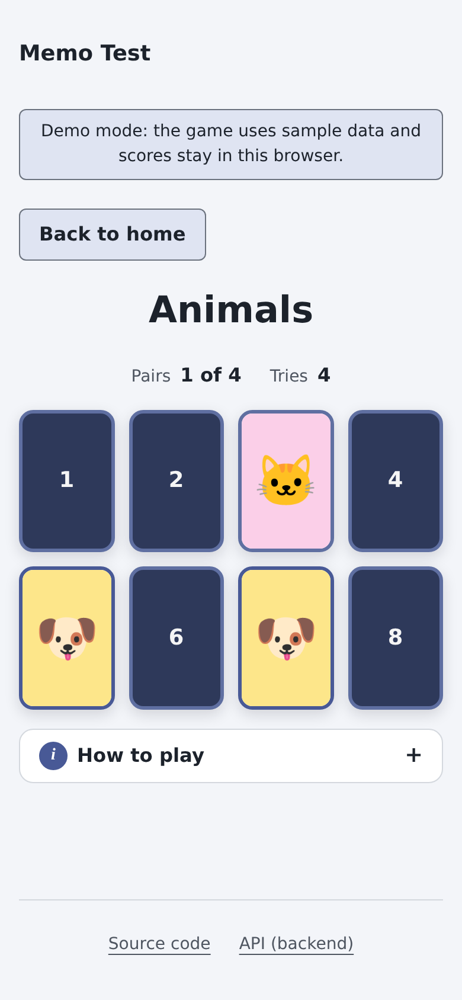
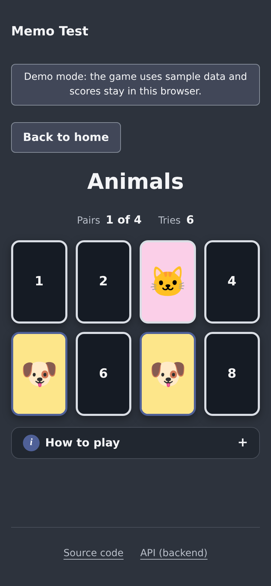

# Memo Test

Juego de memoria: elegís un memo test, das vuelta cartas de a dos y buscás los pares de imágenes. Cada click cuenta como un intento; una partida perfecta vale 100 puntos. Las partidas se pueden dejar a medias y continuar después.

Este repo es el frontend. El backend (Laravel + GraphQL + MySQL) está en [api-memo-test](https://github.com/diegomottadev/api-memo-test). **El backend es opcional**: sin él, o si no responde, la app usa datos de ejemplo y funciona completa.

Demo: https://diegomottadev.github.io/memo-test/ (modo demo, con datos de ejemplo).

## Capturas

|         | Claro                                                               | Oscuro                                                              |
| ------- | ------------------------------------------------------------------- | ------------------------------------------------------------------- |
| Desktop |   |   |
| Desktop |  |  |
| Mobile  |     |     |
| Mobile  |    |    |

## Stack

- React 19, React Router 7 (`react-router`), Vite 8.
- CSS Modules + design tokens (`oklch`, modo claro/oscuro automático).
- GraphQL con `fetch` propio (sin Apollo); datos de ejemplo en el navegador como alternativa.
- Vitest + Testing Library + jsdom; ESLint 9 (flat config, `jsx-a11y`); Prettier 3.
- PropTypes en todos los componentes (validados por ESLint).

## Requisitos

- Node.js 20.19 o superior (probado con Node 24) y npm.
- Opcional: Docker, para levantar el backend.

## Inicio rápido (sin backend)

```bash
git clone https://github.com/diegomottadev/memo-test
cd memo-test
npm install
npm run dev
```

Abrí http://localhost:5173. Sin `VITE_API_URL`, la app usa los datos de ejemplo y lo avisa con un cartel "Demo mode".

## Con el backend real

1. Levantá el backend (un solo comando, ver su README):

   ```bash
   git clone https://github.com/diegomottadev/api-memo-test
   cd api-memo-test
   docker compose up -d
   ```

   La primera vez tarda unos minutos (instala dependencias, crea la base y carga datos). Queda en http://localhost:82/graphql.

2. En este repo, configurá la URL y arrancá:

   ```bash
   cp .env.example .env.local   # VITE_API_URL=http://localhost:82/graphql
   npm run dev
   ```

### De dónde salen los datos

| Situación                                      | Qué hace la app                                                               |
| ---------------------------------------------- | ----------------------------------------------------------------------------- |
| `VITE_API_URL` vacía o sin definir             | Usa los datos de ejemplo desde el inicio.                                     |
| `VITE_API_URL` definida y el servidor responde | Usa el backend.                                                               |
| El servidor no responde                        | Pasa sola a los datos de ejemplo, repite la operación ahí y muestra un aviso. |

"No responde" significa: error de red, más de 5 segundos sin respuesta, un status HTTP de error o una respuesta que no es JSON. Un error GraphQL (el servidor respondió, pero con un error) se muestra como error y no activa el cambio. Una vez que cambió, la app sigue con los datos de ejemplo hasta recargar la página, para no mezclar datos de los dos lados.

Los datos de ejemplo (y sus puntajes) se guardan en el `localStorage` del navegador.

## Comandos

| Comando           | Qué hace                                                         |
| ----------------- | ---------------------------------------------------------------- |
| `npm run dev`     | Servidor de desarrollo en http://localhost:5173.                 |
| `npm run build`   | Build de producción en `dist/`.                                  |
| `npm run preview` | Sirve `dist/` para probar el build.                              |
| `npm test`        | Tests una vez (`npm run test:watch` para modo watch).            |
| `npm run lint`    | ESLint.                                                          |
| `npm run format`  | Formatea todo con Prettier (`npm run format:check` solo revisa). |
| `npm run deploy`  | Publica en GitHub Pages (ver abajo).                             |

Antes de subir cambios: `npm test && npm run lint && npm run format:check && npm run build`.

## Cómo se juega

1. Elegí un memo test y tocá **Start** (o **Continue** si tenés una partida a medias).
2. Dá vuelta una carta y después otra. Si muestran la misma imagen, quedan boca arriba; si no, se dan vuelta solas al segundo.
3. Encontrá todos los pares. Puntaje = cartas ÷ clicks × 100 (cada click en una carta cuenta).

También se juega con teclado (Tab para moverse, Enter para dar vuelta) y con lector de pantalla: cada carta dice su estado y cada jugada se anuncia ("Pair found! Dog.").

## Estructura

```
src/
  api/          única capa que hace fetch: graphqlRequest, memoTestApi (GraphQL), mocks/, createApi (fallback)
  hooks/        useAsync (lecturas), useAsyncAction (escrituras), useMemoGame, useDataSource, useFocusOnMount
  hocs/         withAsyncState (cargando/error/vacío), withErrorBoundary
  components/   <Nombre>/<Nombre>.jsx + <Nombre>.module.css + index.js (presentacionales, con propTypes)
  pages/        Home, GameSession (+ GamePlay), NotFound
  constants/    config, rutas, juego, claves de localStorage, links, stats, pasos de ayuda
  styles/       tokens.css (diseño) y base.css (reset)
  types/        PropTypes compartidos
  utils/        reglas del juego (funciones puras), localStorage seguro, títulos
  testUtils/    renderWithProviders, mock de la API, setup de tests
scripts/deploy.sh
docs/screenshots/
```

Convenciones principales:

- Solo las páginas (y sus hooks) tienen estado; los componentes reciben props.
- Opciones configurables en arrays de `constants/` (links, stats, pasos de ayuda): agregar una opción es agregar un objeto.
- Ningún color o tamaño literal fuera de `src/styles/tokens.css`.
- Todo el texto del código (UI, comentarios, tests) en inglés simple; JSDoc en todo lo exportado.
- Tests al lado del código (`*.test.js(x)`), con queries por rol/label/texto y la capa `api/` mockeada con `vi.mock`.

## Deploy a GitHub Pages

```bash
DRY_RUN=1 npm run deploy   # muestra qué se publicaría, sin commit ni push
npm run deploy             # build y publica en la rama gh-pages
```

El script (`scripts/deploy.sh`):

- Hace el build con base `/<nombre del repo>/` y **sin URL de API** (datos de ejemplo). Para apuntar a un backend público: `DEPLOY_API_URL=https://... npm run deploy`; si ese servidor no responde, la app cambia sola a los datos de ejemplo.
- Prepara la rama `gh-pages` en un worktree temporal (la crea la primera vez), agrega `.nojekyll`, hace commit con tu usuario de git y push **sin** `--force`.

La primera vez, en GitHub: **Settings → Pages → Deploy from a branch → `gh-pages` / root**.

`dev`, `build` y `preview` locales sirven desde `/`; solo el deploy usa el subpath.

## Decisiones

- **Sin Apollo.** Son 5 operaciones simples y no se usaba la caché; un `fetch` propio en `api/` permite inyectar `baseUrl`/`fetchImpl` en tests, cancelar con `AbortController` y decidir el fallback. El bundle bajó de ~465 KB a ~285 KB.
- **`404.html` en lugar de `HashRouter`.** Pages no tiene rutas del lado del servidor; el build copia `index.html` a `404.html`, así un link directo (`/memo-test/game/1/...`) carga la app y `BrowserRouter` resuelve la ruta. Las URLs quedan limpias. Costo: el primer pedido a una ruta profunda responde HTTP 404 aunque la página se vea bien.
- **HOCs para estados de render, hooks para lógica.** `withAsyncState` y `withErrorBoundary` resuelven lo que se repetía en cada pantalla; el estado de la partida y las llamadas viven en hooks.
- **La partida guardada en el navegador es la fuente de verdad para "Continue"**; el backend recibe el progreso en cada par encontrado y el puntaje final.
- **Interfaz en inglés simple**, como el resto del código.

## Limitaciones conocidas

- El backend tiene `endGameSession` en el schema pero sin implementación: las sesiones nunca pasan a `Completed`; solo se guarda el puntaje.
- El "Best score" del backend incluye partidas sin terminar (puntaje 0), por eso puede mostrar `Best score: 0`.
- El backend no tiene descripción de las imágenes: para lectores de pantalla se llaman "Picture 1", "Picture 2"… (los datos de ejemplo sí tienen nombres).
- Las imágenes del backend son links a sitios de terceros; si alguno se cae, esa carta se ve rota.
- Después de cambiar a datos de ejemplo, la app no vuelve a intentar con el servidor hasta recargar.
- No hay usuarios: los puntajes son globales (backend) o de este navegador (datos de ejemplo).

## Pendiente

- [ ] Implementar `endGameSession` en el backend y marcar las sesiones como `Completed`.
- [ ] Excluir partidas sin terminar del "Best score".
- [ ] Guardar descripciones (texto alternativo) de las imágenes en el backend.
- [ ] Imágenes propias en el backend en lugar de links externos.
- [ ] CI con GitHub Actions: tests, lint, formato, build y deploy automático.
- [ ] Tests end-to-end versionados (por ejemplo Playwright) y auditoría de accesibilidad automática.
- [ ] Reintentar contra el servidor sin recargar cuando vuelve a responder.
- [ ] Usuarios y ranking.
- [ ] Actualizar el backend a una versión de Laravel y PHP con soporte.
